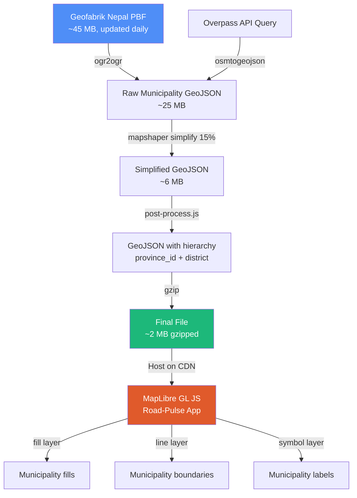

# Integrating Nepal Municipality Boundaries (OSM admin_level=7)

## 1. Understanding the OSM Data Structure

The XML you found is an OSM **relation** (id `12394201` = Banepa Municipality). Here's how it maps to GeoJSON:

| OSM Concept | Role | GeoJSON Equivalent |
|---|---|---|
| `<relation>` | Container for the boundary | `Feature` |
| `<member type="way" role="outer">` | Ordered segments forming the polygon ring | `Polygon.coordinates[0]` (exterior ring) |
| `<member type="way" role="inner">` | Holes (rare for municipalities) | `Polygon.coordinates[1+]` (interior rings) |
| `<member type="relation" role="subarea">` | Child ward boundaries | Ignored for municipality polygons |
| `<tag k="name:en">` | English name | `Feature.properties.name` |
| `<tag k="admin_level" v="7">` | Municipality level | `Feature.properties.admin_level` |
| `<member type="node" role="admin_centre">` | HQ point | Optionally extract as a separate Point feature |

> [!IMPORTANT]
> Raw OSM XML **cannot** be used directly — the `<way>` members contain only node references, not coordinates. The ways must be **resolved** (fetched individually), their nodes resolved to lat/lon, then assembled in order to form closed rings. This is exactly what tools like `osmtogeojson` do automatically.

---

## 2. Overpass API Query for ALL Nepal Municipalities

### Query (copy-paste into [Overpass Turbo](https://overpass-turbo.eu/))

```
[out:json][timeout:120];
// Nepal's country boundary area
area["ISO3166-1"="NP"]->.nepal;

// All admin_level=7 relations within Nepal
relation["admin_level"="7"]["boundary"="administrative"](area.nepal);

// Recursively resolve all member ways and nodes
out body;
>;
out skel qt;
```

### What this does:
1. **`area["ISO3166-1"="NP"]`** — Defines Nepal as the search area
2. **`relation["admin_level"="7"]`** — Finds all municipality boundary relations
3. **`out body; >; out skel qt;`** — The critical part: `>` recursively fetches all member ways and their nodes, giving `osmtogeojson` everything it needs to build polygons

### Direct URL (for scripting):

```
https://overpass-api.de/api/interpreter?data=[out:json][timeout:120];area["ISO3166-1"="NP"]->.nepal;relation["admin_level"="7"]["boundary"="administrative"](area.nepal);out body;>;out skel qt;
```

> [!WARNING]
> This query returns **~50-80 MB** of JSON because it includes all node coordinates for every municipality in Nepal (~753 municipalities). It takes **30-90 seconds** to run. Do NOT call this on every page load.

---

## 3. Conversion Pipeline: OSM → GeoJSON

### Option A: Overpass Turbo (Manual/One-time)

1. Go to [overpass-turbo.eu](https://overpass-turbo.eu/)
2. Paste the query from Section 2
3. Click **Run**
4. Click **Export → GeoJSON** — Overpass Turbo uses `osmtogeojson` internally
5. Save the file as `nepal-municipalities.geojson`

### Option B: Node.js Script (Automated Pipeline)

```bash
npm install osmtogeojson
```

```javascript
// fetch-municipalities.js
const https = require('https');
const fs = require('fs');
const osmtogeojson = require('osmtogeojson');

const query = `[out:json][timeout:120];
area["ISO3166-1"="NP"]->.nepal;
relation["admin_level"="7"]["boundary"="administrative"](area.nepal);
out body;>;out skel qt;`;

const url = `https://overpass-api.de/api/interpreter?data=${encodeURIComponent(query)}`;

console.log('Fetching Nepal municipalities from Overpass API...');
console.log('This may take 30-90 seconds...');

https.get(url, (res) => {
  let data = '';
  res.on('data', chunk => data += chunk);
  res.on('end', () => {
    console.log(`Received ${(data.length / 1024 / 1024).toFixed(1)} MB of OSM data`);

    const osmData = JSON.parse(data);
    const geojson = osmtogeojson(osmData);

    // Normalize properties for your system
    geojson.features = geojson.features
      .filter(f => f.geometry.type === 'Polygon' || f.geometry.type === 'MultiPolygon')
      .map((f, i) => {
        const tags = f.properties.tags || f.properties;
        return {
          type: 'Feature',
          id: f.id || i,
          properties: {
            osm_id: f.id,
            name: tags['name:en'] || tags.name || 'Unknown',
            name_ne: tags['name:ne'] || tags.name || '',
            admin_level: 7,
            type: tags['name:suffix:en'] || 'Municipality',
            // These will be filled in post-processing (Section 7)
            province_id: null,
            district: null
          },
          geometry: f.geometry
        };
      });

    fs.writeFileSync(
      'nepal-municipalities.geojson',
      JSON.stringify(geojson, null, 0) // no indentation to save space
    );

    console.log(`Saved ${geojson.features.length} municipality polygons`);
  });
}).on('error', console.error);
```

### Option C: Using `ogr2ogr` (GDAL — most robust)

```bash
# Install GDAL
sudo apt install gdal-bin

# Download raw OSM data for Nepal (from Geofabrik)
wget https://download.geofabrik.de/asia/nepal-latest.osm.pbf

# Extract admin_level=7 boundaries directly to GeoJSON
ogr2ogr -f GeoJSON nepal-municipalities.geojson \
  nepal-latest.osm.pbf \
  -sql "SELECT * FROM multipolygons WHERE admin_level = '7' AND boundary = 'administrative'" \
  -lco RFC7946=YES
```

> [!TIP]
> **Option C is the most reliable** — Geofabrik data is pre-processed daily, avoids Overpass timeouts, and `ogr2ogr` handles complex multipolygon relations flawlessly. The PBF file for Nepal is only ~45 MB.

---

## 4. Preprocessed (Static) vs Dynamic Loading

### Recommendation: **Preprocessed static file** — strongly recommended

| Factor | Static GeoJSON File | Dynamic Overpass API |
|---|---|---|
| **Load time** | ~1-3s (CDN-served, compressed) | 30-90s per request |
| **Reliability** | 100% (your server) | Overpass can timeout/rate-limit |
| **Data size** | ~5-15 MB (simplified) | ~50-80 MB raw |
| **Freshness** | Update weekly/monthly | Always current |
| **OSM policy** | No concern | Must respect usage policy |
| **Offline** | Works | Doesn't |

> [!CAUTION]
> The Overpass API has a **fair use policy** — repeated bulk queries will get you rate-limited or blocked. Municipality boundaries change maybe once a year. Static preprocessing is the correct approach.

### Recommended Architecture

```
┌──────────────┐     ┌──────────────────┐     ┌────────────────────┐
│ Overpass API │────▶│ Build Script     │────▶│ Static GeoJSON     │
│ (or Geofabrik)│     │ (Node.js/Python) │     │ (CDN / GitHub)     │
│              │     │ + simplify       │     │ nepal-munis.geojson │
│ Run monthly  │     │ + add hierarchy  │     │ ~5-8 MB gzipped    │
└──────────────┘     └──────────────────┘     └────────┬───────────┘
                                                       │
                                              ┌────────▼───────────┐
                                              │ MapLibre GL JS     │
                                              │ fetch() on demand  │
                                              │ (when district     │
                                              │  is selected)      │
                                              └────────────────────┘
```

---

## 5. Simplification (Critical for Performance)

Raw OSM municipality polygons have **excessive detail** — tens of thousands of coordinate pairs per municipality. You need to simplify for MapLibre.

```bash
# Install mapshaper (best tool for this)
npm install -g mapshaper

# Simplify to ~15% of original points (good balance for zoom 7-14)
mapshaper nepal-municipalities.geojson \
  -simplify dp 15% \
  -o nepal-municipalities-simplified.geojson format=geojson
```

Or in the Node.js pipeline:

```bash
npm install @turf/simplify
```

```javascript
const turf = require('@turf/simplify');

// Simplify each feature (tolerance in degrees, ~0.001 ≈ 100m)
geojson.features = geojson.features.map(f =>
  turf.simplify(f, { tolerance: 0.001, highQuality: true })
);
```

**Expected size reduction:**
| Stage | Size |
|---|---|
| Raw from Overpass | ~50-80 MB |
| After `osmtogeojson` (polygons only) | ~20-30 MB |
| After simplification (15%) | ~5-8 MB |
| Gzipped (what browser downloads) | ~1.5-2.5 MB |

---

## 6. MapLibre GL JS Integration

Here's how to add municipality layers to your existing system, fitting into your current architecture:

```javascript
// ════════════════════════════════════════════════════════════════════
// MUNICIPALITY LAYER — loads when a district is selected
// ════════════════════════════════════════════════════════════════════

// Cache: district name → GeoJSON FeatureCollection
const muniCache = {};

// If using a single pre-built file with ALL municipalities:
let allMuniGJ = null;

async function loadAllMunicipalities() {
  if (allMuniGJ) return allMuniGJ;

  const urls = [
    // Host on your own CDN/GitHub for reliability
    '/data/nepal-municipalities.geojson',
    'https://cdn.jsdelivr.net/gh/YOUR_REPO/nepal-municipalities.geojson'
  ];

  for (const url of urls) {
    try {
      const r = await fetch(url, fetchOpts(15000));
      if (!r.ok) throw new Error(r.status);
      allMuniGJ = await r.json();
      // Ensure each feature has a numeric id for feature-state
      allMuniGJ.features.forEach((f, i) => { if (f.id == null) f.id = i; });
      console.log('✓ Municipality data loaded:', allMuniGJ.features.length, 'features');
      return allMuniGJ;
    } catch (e) {
      console.warn('Municipality load failed:', url, e.message);
    }
  }
  return null;
}

// Filter municipalities for a specific district
function getMunisForDistrict(districtName) {
  if (muniCache[districtName]) return muniCache[districtName];
  if (!allMuniGJ) return null;

  const filtered = {
    type: 'FeatureCollection',
    features: allMuniGJ.features.filter(f =>
      f.properties.district?.toLowerCase() === districtName.toLowerCase()
    )
  };
  muniCache[districtName] = filtered;
  return filtered;
}

// Build municipality layers on the map
function buildMuniLayer(districtName) {
  const muniGJ = getMunisForDistrict(districtName);
  if (!muniGJ || !muniGJ.features.length) {
    toast('No municipality boundaries available for ' + districtName);
    return;
  }

  srcSet('municipalities', muniGJ);

  // Remove existing municipality layers
  ['mf', 'ml', 'mla'].forEach(rmL);

  // Municipality fills
  map.addLayer({
    id: 'mf', type: 'fill', source: 'municipalities',
    paint: {
      'fill-color': ['case',
        ['boolean', ['feature-state', 'sel'], false], 'rgba(100, 220, 150, 0.25)',
        ['boolean', ['feature-state', 'hover'], false], 'rgba(100, 220, 150, 0.12)',
        'rgba(100, 220, 150, 0.05)'
      ],
      'fill-opacity': 1
    }
  });

  // Municipality boundary lines
  map.addLayer({
    id: 'ml', type: 'line', source: 'municipalities',
    paint: {
      'line-color': '#64dc96',
      'line-width': ['interpolate', ['linear'], ['zoom'], 8, 0.5, 12, 1.5, 15, 2.5],
      'line-opacity': 0.85
    }
  });

  // Municipality labels
  map.addLayer({
    id: 'mla', type: 'symbol', source: 'municipalities',
    minzoom: 10,
    layout: {
      'text-field': ['get', 'name'],
      'text-size': ['interpolate', ['linear'], ['zoom'], 10, 9, 14, 13],
      'text-font': ['Open Sans Semibold'],
      'text-max-width': 7
    },
    paint: {
      'text-color': '#a8f0c0',
      'text-halo-color': '#0f1117',
      'text-halo-width': 1.5
    }
  });

  // Keep province outlines on top
  liftProvinceHighlight();

  // Hover tracking
  let hoveredMuniId = null;
  map.on('mousemove', 'mf', e => {
    if (e.features.length > 0) {
      if (hoveredMuniId !== null) {
        map.setFeatureState({ source: 'municipalities', id: hoveredMuniId }, { hover: false });
      }
      hoveredMuniId = e.features[0].id;
      map.setFeatureState({ source: 'municipalities', id: hoveredMuniId }, { hover: true });
      map.getCanvas().style.cursor = 'pointer';
    }
  });
  map.on('mouseleave', 'mf', () => {
    if (hoveredMuniId !== null) {
      map.setFeatureState({ source: 'municipalities', id: hoveredMuniId }, { hover: false });
    }
    hoveredMuniId = null;
    map.getCanvas().style.cursor = '';
  });

  // Click handler
  map.on('click', 'mf', e => {
    if (!e.features[0]) return;
    const f = e.features[0];
    const p = f.properties;
    activeLevel = 'municipality';
    setActivePill('municipality');

    clearFS('municipalities');
    map.setFeatureState({ source: 'municipalities', id: f.id }, { sel: true });

    showCard(p.name, p.type || 'Municipality', [
      { l: 'District', v: districtName },
      { l: 'Province', v: selProv?.properties?.name || '—' },
      { l: 'Type', v: p.type || 'Municipality' },
      { l: 'OSM ID', v: p.osm_id || '—' }
    ], '#64dc96');

    // Zoom to municipality
    const b = geomBounds(f.geometry);
    map.fitBounds(b, {
      padding: { top: 80, bottom: 60, left: 265, right: 60 },
      duration: 600
    });
  });

  console.log('✓ Municipality layer built for', districtName, '-', muniGJ.features.length, 'municipalities');
}
```

### Wire it into your existing `onDistClick`:

```diff
 function onDistClick(dn, pid) {
   selDist = dn;
   activeLevel = 'district';
   // ... existing code ...
   panelMunis(dn, pid, pc);
+
+  // Load and display municipality boundaries
+  loadAllMunicipalities().then(() => {
+    buildMuniLayer(dn);
+  });
 }
```

---

## 7. Aligning with Province → District → Municipality Hierarchy

The raw OSM data **does not** include province/district parent info in each municipality relation. You need to add it during preprocessing.

### Strategy: Spatial join using `@turf/boolean-point-in-polygon`

```javascript
// post-process.js — Run after fetching municipality GeoJSON
const turf = require('@turf/boolean-point-in-polygon');
const centroid = require('@turf/centroid');

// Load your existing data
const provinces = require('./nepal-states.geojson');     // from mesaugat
const districts = require('./nepal-districts.geojson');   // from mesaugat
const munis = require('./nepal-municipalities.geojson');  // from Overpass

// Build district → province lookup from your DISTRICTS constant
const DISTRICTS = { /* your existing mapping */ };
const distToProvince = {};
for (const [pid, dists] of Object.entries(DISTRICTS)) {
  for (const d of dists) {
    distToProvince[d.toLowerCase()] = +pid;
  }
}

// For each municipality, find which district polygon contains its centroid
munis.features.forEach(muni => {
  const center = centroid(muni);

  // Find containing district
  for (const dist of districts.features) {
    const distName = dist.properties.DISTRICT || dist.properties.name;
    if (turf(center, dist)) {
      muni.properties.district = distName;
      muni.properties.province_id = distToProvince[distName.toLowerCase()] || null;
      break;
    }
  }

  // Fallback: check province directly
  if (!muni.properties.province_id) {
    for (const prov of provinces.features) {
      if (turf(center, prov)) {
        muni.properties.province_id = prov.properties.id;
        break;
      }
    }
  }
});

// Verify coverage
const unmatched = munis.features.filter(f => !f.properties.district);
console.log(`Matched: ${munis.features.length - unmatched.length}/${munis.features.length}`);
if (unmatched.length) {
  console.log('Unmatched:', unmatched.map(f => f.properties.name));
}
```

### Alternative: Use OSM hierarchy directly

OSM has `admin_level=5` (districts) and `admin_level=4` (provinces). You can fetch all three levels and use the `subarea` relations:

```
[out:json][timeout:180];
area["ISO3166-1"="NP"]->.nepal;

// Provinces (admin_level=4)
relation["admin_level"="4"]["boundary"="administrative"](area.nepal);
out body;

// Districts (admin_level=5 in OSM Nepal)  
relation["admin_level"="5"]["boundary"="administrative"](area.nepal);
out body;

// Municipalities (admin_level=7)
relation["admin_level"="7"]["boundary"="administrative"](area.nepal);
out body;

>;
out skel qt;
```

> [!NOTE]
> Nepal's OSM admin levels: 2=Country, 3=Zone (obsolete), 4=Province, 5=District, 7=Municipality, 9=Ward. Level 6 is unused.

---

## 8. Caching Strategy

### Layer 1: Build-time static file (primary)
- Run the preprocessing script monthly (or on OSM data update)
- Host the simplified GeoJSON on GitHub Pages / CDN / your server
- **This is the file your app loads**

### Layer 2: Browser caching
```javascript
// Use Cache API for persistent browser-side caching
async function fetchWithCache(url, cacheName = 'road-pulse-geo', maxAge = 7 * 24 * 3600 * 1000) {
  const cache = await caches.open(cacheName);
  const cached = await cache.match(url);

  if (cached) {
    const cachedDate = cached.headers.get('x-cached-date');
    if (cachedDate && Date.now() - new Date(cachedDate).getTime() < maxAge) {
      console.log('Using cached:', url);
      return cached.json();
    }
  }

  const response = await fetch(url);
  const data = await response.json();

  // Clone and store with timestamp
  const headers = new Headers(response.headers);
  headers.set('x-cached-date', new Date().toISOString());
  const cachedResponse = new Response(JSON.stringify(data), { headers });
  await cache.put(url, cachedResponse);

  return data;
}
```

### Layer 3: Per-district lazy loading (optional optimization)
If the full municipality file is too large, split by district:

```
/data/municipalities/
  ├── kathmandu.geojson      (11 municipalities)
  ├── kaski.geojson           (6 municipalities)
  ├── morang.geojson          (17 municipalities)
  └── ... (77 files)
```

Load only when a district is selected:
```javascript
async function loadDistrictMunis(districtName) {
  const slug = districtName.toLowerCase().replace(/\s+/g, '-');
  return fetchWithCache(`/data/municipalities/${slug}.geojson`);
}
```

---

## 9. Complete Pipeline Summary



### Quick-start commands:

```bash
# 1. Get the data (choose one)
wget https://download.geofabrik.de/asia/nepal-latest.osm.pbf
# OR use the Overpass query

# 2. Extract municipalities
ogr2ogr -f GeoJSON raw-munis.geojson nepal-latest.osm.pbf \
  -sql "SELECT * FROM multipolygons WHERE admin_level = '7' AND boundary = 'administrative'"

# 3. Simplify
npx mapshaper raw-munis.geojson -simplify dp 15% -o nepal-municipalities.geojson

# 4. Add hierarchy metadata (run post-process.js from Section 7)
node post-process.js

# 5. Host the file and update your app
```

---

## 10. Key Integration Points in Your Current Code

| Current Code | What to Add/Change |
|---|---|
| [panelMunis()](file:///home/kebal/project/road-pulse/webapp/index.html#L1274-L1298) | Replace fake `District Sn N` names with real municipality names from GeoJSON |
| [onDistClick()](file:///home/kebal/project/road-pulse/webapp/index.html#L1203-L1217) | Add `loadAllMunicipalities().then(() => buildMuniLayer(dn))` call |
| [MUNI_CNT](file:///home/kebal/project/road-pulse/webapp/index.html#L777-L794) | Can be dynamically computed from the GeoJSON instead of hardcoded |
| [init()](file:///home/kebal/project/road-pulse/webapp/index.html#L1375-L1412) | Optionally preload municipality data in background after districts load |

> [!TIP]
> Start with **Option A** (Overpass Turbo manual export) to validate the approach quickly, then automate with **Option C** (Geofabrik + ogr2ogr) for production.
